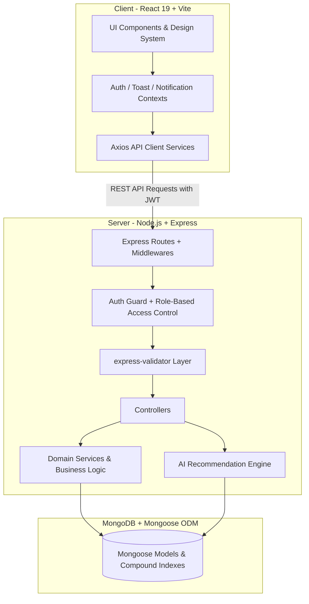

# Medico — Healthcare Appointment & Medical Consultation Platform

Medico is a full-stack, production-grade healthcare platform designed for patient consultation scheduling, physician practice management, administrative governance, ratings & reviews, in-app notifications, and AI-assisted doctor recommendations.

---

## Table of Contents

1. [Architectural Overview](#architectural-overview)
2. [Technology Stack](#technology-stack)
3. [Prerequisites & System Requirements](#prerequisites--system-requirements)
4. [Installation & Setup](#installation--setup)
5. [Environment Variables](#environment-variables)
6. [Running the Application](#running-the-application)
7. [Database Models](#database-models)
8. [API Endpoints Reference](#api-endpoints-reference)
9. [Platform Modules & Key Features](#platform-modules--key-features)
10. [Seed Credentials & Demo Access](#seed-credentials--demo-access)
11. [Testing & Verification](#testing--verification)
12. [Production Deployment](#production-deployment)

---

## Architectural Overview

Medico adheres to a strict layered, decoupled client-server architecture:



### Layer Responsibilities

- **Routes (`server/src/routes`)**: Define endpoint paths, HTTP verbs, and mount security and validation middlewares.
- **Middleware (`server/src/middleware`)**: Authentication token verification (`protect`), role-based authorization (`authorizeRoles`), CORS headers, and centralized error handling.
- **Validators (`server/src/validators`)**: Input sanitization and payload validation using `express-validator`.
- **Controllers (`server/src/controllers`)**: Parse incoming requests, coordinate services, and construct uniform responses via `apiResponse.js`.
- **Services (`server/src/services`)**: Core business rules, data access, conflict prevention, notification dispatch, and ranking algorithms.
- **Models (`server/src/models`)**: Mongoose schemas, data validation, compound indexes, pre-save hooks, and JSON serialization transforms.

---

## Technology Stack

### Backend
- **Runtime**: Node.js (v18+)
- **Framework**: Express.js 4.x
- **Database**: MongoDB with Mongoose 8.x ODM
- **Authentication**: JSON Web Tokens (`jsonwebtoken`) + Blowfish password hashing (`bcryptjs`)
- **Validation**: `express-validator`
- **Logging**: Morgan HTTP request logger

### Frontend
- **Framework**: React 19 + Vite 8
- **Routing**: React Router 7
- **HTTP Client**: Axios with request/response interceptors
- **Icons**: Lucide React
- **Styling**: Vanilla CSS Design System with CSS variables, responsive design, dark-mode ready tokens, glassmorphism, and micro-animations

---

## Prerequisites & System Requirements

- **Node.js**: `v18.0.0` or higher
- **npm**: `v9.0.0` or higher
- **MongoDB**: Local MongoDB instance (`mongodb://127.0.0.1:27017/medico_db`) or MongoDB Atlas URI

---

## Installation & Setup

### 1. Clone & Navigate to Repository
```bash
git clone <repository_url>
cd medico
```

### 2. Install Dependencies
Install all workspace, client, and server dependencies with a single command:
```bash
npm run install:all
```
*(Or install manually)*:
```bash
npm install
cd server && npm install && cd ..
cd client && npm install && cd ..
```

### 3. Configure Environment Variables
Copy the sample environment files and configure your credentials:

```bash
# Server environment
cp server/.env.example server/.env

# Client environment
cp client/.env.example client/.env
```

---

## Environment Variables

### Server (`server/.env`)
| Variable | Description | Default / Example |
| :--- | :--- | :--- |
| `PORT` | Backend server port | `5001` |
| `NODE_ENV` | Application environment | `development` / `production` |
| `MONGO_URI` | MongoDB connection string | `mongodb://127.0.0.1:27017/medico_db` |
| `JWT_SECRET` | Secret key for signing JWT tokens | `your_secure_jwt_secret_key` |
| `JWT_EXPIRES_IN` | Token expiration duration | `7d` |
| `CLIENT_URL` | Allowed CORS origins (comma-separated) | `http://localhost:5173,http://localhost:3000` |
| `ADMIN_EMAIL` | Default administrator seed email | `admin@medico.com` |
| `ADMIN_PASSWORD` | Default administrator seed password | `Admin@12345` |

### Client (`client/.env`)
| Variable | Description | Default / Example |
| :--- | :--- | :--- |
| `VITE_API_URL` | Backend REST API base URL | `http://localhost:5001/api` |

---

## Running the Application

### Seed Initial Data (Admin & Specializations)
The server automatically checks and seeds the platform administrator and initial medical specializations upon startup. You can also trigger the seeder explicitly:
```bash
npm run seed --workspace=server
```

### Start Development Environment (Concurrent)
To start both the backend API server (`http://localhost:5001`) and the Vite frontend dev server (`http://localhost:5173`) together:
```bash
npm run dev
```

### Run Individually

**Backend Server**:
```bash
cd server
npm run dev    # with hot-reload via nodemon
# or: npm start
```

**Frontend Client**:
```bash
cd client
npm run dev    # Vite dev server on port 5173
```

### Build for Production

**Frontend Bundle**:
```bash
cd client
npm run build
```

---

## Database Models

### 1. `User` (`server/src/models/User.js`)
Core authentication entity representing all platform users (Patients, Doctors, Administrators).
- `name`: String, required, trimmed, max 100 chars.
- `email`: String, required, unique, lowercase, trimmed, validated.
- `password`: String, required, minlength 6, hashed with bcrypt (salt 10), hidden by default (`select: false`).
- `role`: Enum `['PATIENT', 'DOCTOR', 'ADMIN']`, default `'PATIENT'`.
- `phone`: String, trimmed.
- `profileImage` / `avatar`: String (URL).
- `isActive`: Boolean, default `true` (governed by Admin).
- **Hooks & Methods**: Pre-save password hashing, `comparePassword()` method, JSON transform hiding password hash.

### 2. `Patient` (`server/src/models/Patient.js`)
Linked clinical profile for users with role `PATIENT`.
- `user`: ObjectId referencing `User`, unique, required.
- `gender`: Enum `['MALE', 'FEMALE', 'OTHER', 'PREFER_NOT_TO_SAY']`.
- `bloodGroup`: Enum `['A+', 'A-', 'B+', 'B-', 'AB+', 'AB-', 'O+', 'O-', 'UNKNOWN']`.
- `dateOfBirth`: Date.
- `address`: Embedded object (`street`, `city`, `state`, `zipCode`).
- `emergencyContact`: Embedded object (`name`, `relationship`, `phone`).
- `allergies`: Array of Strings.
- `medicalHistory`: Array of Strings.

### 3. `Doctor` (`server/src/models/Doctor.js`)
Linked physician profile for users with role `DOCTOR`.
- `user`: ObjectId referencing `User`, unique, required.
- `specialization`: String, required, indexed.
- `specializationRef`: ObjectId referencing `Specialization`.
- `licenseNumber`: String, required, unique.
- `qualifications`: Array of Strings (e.g. `['MD', 'FACS']`).
- `experienceYears`: Number, min 0.
- `consultationFee`: Number, required, min 0.
- `hospitalAffiliation`: String.
- `bio`: String, max 1000 chars.
- `approvalStatus`: Enum `['PENDING', 'APPROVED', 'REJECTED']`, default `'PENDING'`.
- `rejectionReason`: String.
- `rating`: Embedded object (`average`: Number 0-5, `count`: Number).

### 4. `Specialization` (`server/src/models/Specialization.js`)
Medical specialties catalog.
- `name`: String, required, unique.
- `description`: String.
- `icon`: String (Lucide icon identifier).

### 5. `Availability` (`server/src/models/Availability.js`)
Physician weekly operating schedule and slot configuration.
- `doctor`: ObjectId referencing `Doctor`, unique, required.
- `workingDays`: Array of Day Strings (`['Monday', 'Tuesday', ...]`).
- `startTime`: String (`HH:mm`), e.g. `'09:00'`.
- `endTime`: String (`HH:mm`), e.g. `'17:00'`.
- `slotDuration`: Number in minutes (e.g. 15, 30, 45, 60), default 30.
- `breakStartTime` / `breakEndTime`: String (`HH:mm`).
- `blockedDates`: Array of ISO date strings (`YYYY-MM-DD`).
- `isActive`: Boolean, default `true`.

### 6. `Appointment` (`server/src/models/Appointment.js`)
Consultation booking records between patients and doctors.
- `patient`: ObjectId referencing `Patient`, required, indexed.
- `doctor`: ObjectId referencing `Doctor`, required, indexed.
- `date`: String (`YYYY-MM-DD`), indexed.
- `startTime`: String (`HH:mm`), required.
- `endTime`: String (`HH:mm`), required.
- `reason`: String, required, max 500 chars.
- `symptoms`: String, max 1000 chars.
- `status`: Enum `['PENDING', 'CONFIRMED', 'COMPLETED', 'CANCELLED', 'RESCHEDULED']`.
- `rescheduledFrom`: Embedded object (`previousDate`, `previousStartTime`, `previousEndTime`).
- `cancellationReason`: String.
- **Compound Indexes**:
  - `{ doctor: 1, date: 1, startTime: 1, status: 1 }` (conflict prevention)
  - `{ patient: 1, date: 1, status: 1 }`

### 7. `Review` (`server/src/models/Review.js`)
Post-consultation ratings and patient feedback.
- `appointment`: ObjectId referencing `Appointment`, required, unique (one review per appointment).
- `patient`: ObjectId referencing `Patient`, required, indexed.
- `doctor`: ObjectId referencing `Doctor`, required, indexed.
- `rating`: Number, required, integer 1-5.
- `comment`: String, required, max 1000 chars.
- `isVisible`: Boolean, default `true` (governed by Admin moderation).
- **Hooks**: Automatic recalculation of doctor's `rating.average` and `rating.count` upon review creation, modification, or deletion.

### 8. `Notification` (`server/src/models/Notification.js`)
In-app persistent notification stream.
- `recipient`: ObjectId referencing `User`, required, indexed.
- `type`: Enum `['APPOINTMENT_BOOKED', 'APPOINTMENT_CONFIRMED', 'APPOINTMENT_CANCELLED', 'APPOINTMENT_RESCHEDULED', 'NEW_APPOINTMENT', 'DOCTOR_REGISTRATION', 'DOCTOR_APPROVAL', 'SYSTEM']`.
- `title`: String, required, max 200 chars.
- `message`: String, required, max 1000 chars.
- `data`: Mixed object (e.g. `{ appointmentId, doctorId, link }`).
- `isRead`: Boolean, default `false`, indexed.
- `readAt`: Date.
- **Compound Index**: `{ recipient: 1, isRead: 1, createdAt: -1 }`.

---

## API Endpoints Reference

### Authentication (`/api/auth`)
| Method | Endpoint | Access | Description |
| :--- | :--- | :--- | :--- |
| `POST` | `/api/auth/register` | Public | Register new Patient or Doctor (Admin blocked) |
| `POST` | `/api/auth/login` | Public | Authenticate user and obtain JWT bearer token |
| `GET` | `/api/auth/me` | Authenticated | Retrieve current user profile and session info |

### Patients (`/api/patient`)
| Method | Endpoint | Access | Description |
| :--- | :--- | :--- | :--- |
| `GET` | `/api/patient/profile` | Patient | Retrieve medical profile |
| `PUT` | `/api/patient/profile` | Patient | Update medical profile (allergies, contact, address) |
| `POST` | `/api/patient/recommend-doctor` | Patient | AI-assisted doctor recommendations from symptoms |

### Doctors (`/api/doctors`)
| Method | Endpoint | Access | Description |
| :--- | :--- | :--- | :--- |
| `GET` | `/api/doctors` | Public | Browse doctors with search, specialty, and fee filters |
| `GET` | `/api/doctors/:id` | Public | View public physician profile, ratings, and reviews |
| `POST` | `/api/doctors/recommend` | Public | AI doctor discovery matching natural language symptoms |
| `GET` | `/api/doctors/profile/me` | Doctor | Retrieve practice profile |
| `PUT` | `/api/doctors/profile/me` | Doctor | Update bio, qualifications, hospital affiliation, fees |

### Availability (`/api/availability`)
| Method | Endpoint | Access | Description |
| :--- | :--- | :--- | :--- |
| `GET` | `/api/availability/me` | Doctor | Get doctor's weekly operating schedule |
| `PUT` | `/api/availability/me` | Doctor | Configure operating days, hours, slot duration, breaks |
| `DELETE`| `/api/availability/me` | Doctor | Reset availability to standard default schedule |
| `POST` | `/api/availability/me/block-date` | Doctor | Block specific calendar date from bookings |
| `POST` | `/api/availability/me/unblock-date` | Doctor | Unblock previously blocked date |
| `GET` | `/api/availability/doctor/:id/slots` | Public | Calculate open, available time slots for a given date |

### Appointments (`/api/appointments`)
| Method | Endpoint | Access | Description |
| :--- | :--- | :--- | :--- |
| `POST` | `/api/appointments` | Patient | Book consultation slot (prevents double-booking) |
| `GET` | `/api/appointments/my-appointments` | Patient | List patient appointments (filter by upcoming/past/cancelled) |
| `GET` | `/api/appointments/doctor-appointments`| Doctor | List doctor appointments (today/upcoming/completed/cancelled) |
| `GET` | `/api/appointments/doctor-stats` | Doctor | Get statistical metrics (today, completed, patients count) |
| `GET` | `/api/appointments/:id` | Owner / Admin | Retrieve individual appointment details |
| `PATCH`| `/api/appointments/:id/confirm` | Doctor | Confirm consultation appointment |
| `PATCH`| `/api/appointments/:id/complete`| Doctor | Mark completed consultation |
| `PATCH`| `/api/appointments/:id/reject` | Doctor | Decline appointment with cancellation reason |
| `PATCH`| `/api/appointments/:id/cancel` | Patient | Cancel appointment with cancellation reason |
| `PATCH`| `/api/appointments/:id/reschedule`| Patient | Reschedule appointment to a new available time slot |

### Reviews & Ratings (`/api/reviews`)
| Method | Endpoint | Access | Description |
| :--- | :--- | :--- | :--- |
| `POST` | `/api/reviews` | Patient | Review completed consultation (1-5 stars, duplicate checked) |
| `GET` | `/api/reviews/doctor/:doctorId` | Public | Retrieve verified patient reviews for a doctor |
| `GET` | `/api/reviews/my-reviews` | Patient | Retrieve patient's submitted reviews |
| `GET` | `/api/reviews/check/:appointmentId` | Patient | Check whether review already exists for appointment |
| `DELETE`| `/api/reviews/:id` | Patient / Admin| Delete review |
| `GET` | `/api/reviews/admin/all` | Admin | List all reviews with moderation filters |
| `PATCH`| `/api/reviews/:id/visibility` | Admin | Moderate review (soft hide / restore) |

### Notifications (`/api/notifications`)
| Method | Endpoint | Access | Description |
| :--- | :--- | :--- | :--- |
| `GET` | `/api/notifications` | Authenticated | Get paginated user notifications (filter by read/unread) |
| `GET` | `/api/notifications/unread-count` | Authenticated | Get real-time unread badge counter |
| `PATCH`| `/api/notifications/:id/read` | Authenticated | Mark individual notification as read |
| `PATCH`| `/api/notifications/read-all` | Authenticated | Mark all notifications as read |
| `DELETE`| `/api/notifications/:id` | Authenticated | Delete single notification |
| `DELETE`| `/api/notifications` | Authenticated | Clear all user notifications |

### Admin Governance (`/api/admin`)
| Method | Endpoint | Access | Description |
| :--- | :--- | :--- | :--- |
| `GET` | `/api/admin/stats` | Admin | Platform-wide metrics (patients, doctors, appointments) |
| `GET` | `/api/admin/doctors` | Admin | List doctors with approval and search filters |
| `GET` | `/api/admin/doctors/:id` | Admin | Detailed doctor profile, credentials, and schedule |
| `PATCH`| `/api/admin/doctors/:id/approve` | Admin | Approve doctor credentials for platform booking |
| `PATCH`| `/api/admin/doctors/:id/reject` | Admin | Decline doctor application with reason |
| `PATCH`| `/api/admin/doctors/:id/status` | Admin | Activate or deactivate doctor account |
| `GET` | `/api/admin/patients` | Admin | List patients with search and medical history |
| `GET` | `/api/admin/patients/:id` | Admin | Patient profile and complete consultation history |
| `PATCH`| `/api/admin/patients/:id/status` | Admin | Activate or deactivate patient account |
| `GET` | `/api/admin/appointments` | Admin | Platform-wide appointment ledger with filters |
| `PATCH`| `/api/admin/appointments/:id/cancel` | Admin | Cancel any appointment with admin reason |

---

## Seed Credentials & Demo Access

For testing and demonstration, pre-seeded accounts can be used:

| Role | Email | Password | Primary Portal Route |
| :--- | :--- | :--- | :--- |
| **System Administrator** | `admin@medico.com` | `Admin@12345` | `/admin/dashboard` |
| **Verified Doctor** | `doctor@test.com` | `Doctor123` | `/doctor/dashboard` |
| **Patient User** | `jane@example.com` | `Password123` | `/patient/dashboard` |

*(Quick-fill convenience buttons are provided on the login page at `/login` for instantaneous testing).*

---

## Testing & Verification

A comprehensive test suite is included in the project:

```bash
# Execute master end-to-end production audit
node .system_generated/../scratch/test_production_audit.js

# Execute Phase 9 notification system test
node .system_generated/../scratch/test_phase9.js

# Execute Phase 10 AI doctor recommendation test
node .system_generated/../scratch/test_phase10.js

# Verify client production build
npm run build --workspace=client
```

---

## Production Deployment

### Backend Deployment (Render / Railway / AWS / Heroku)
1. **Root Directory**: `server`
2. **Build Command**: `npm install`
3. **Start Command**: `npm start`
4. **Environment Variables**:
   - `PORT`: Assigned by host (e.g. `5001`)
   - `NODE_ENV`: `production`
   - `MONGO_URI`: MongoDB Atlas cluster URI
   - `JWT_SECRET`: High-entropy 64+ char random secret
   - `JWT_EXPIRES_IN`: `7d`
   - `CLIENT_URL`: Deployed frontend domain(s) (e.g. `https://medico.vercel.app`)
   - `ADMIN_EMAIL` & `ADMIN_PASSWORD`: Production admin credentials

### Frontend Deployment (Vercel / Netlify / Cloudflare Pages)
1. **Root Directory**: `client`
2. **Build Command**: `npm run build`
3. **Output Directory**: `dist`
4. **Environment Variables**:
   - `VITE_API_URL`: Deployed backend API URL (e.g. `https://api-medico.onrender.com/api`)
5. **SPA Routing**: Single Page Application rewrite rules are configured in `client/public/_redirects` and `client/vercel.json`.

---

## License

This project is licensed under the MIT License.
